# Sentire BIR Form Generator — System Design Document

**Version 1.0 · July 6, 2026 · Draft for Review**

---

## Table of Contents

1. [Introduction & Scope](#1-introduction--scope)
2. [System Requirements](#2-system-requirements)
3. [System Actors](#3-system-actors)
4. [Top Use Cases](#4-top-use-cases)
5. [Class Diagram (Domain Model)](#5-class-diagram-domain-model)
6. [Activity Diagrams](#6-activity-diagrams)
7. [API Integration — Accounting Firm Portal](#7-api-integration--accounting-firm-portal)
8. [Supported Forms & Computation Engine](#8-supported-forms--computation-engine)
9. [Appendices](#9-appendices)

---

## 1. Introduction & Scope

### 1.1 Purpose

The **Sentire BIR Form Generator** is a web application that produces accurate, print-faithful
**Philippine BIR tax forms** and their **eBIRForms XML** exports. For a given **taxpayer** and
**period**, it presents two always-synchronized views — a **Guided** wizard and a pixel-faithful,
A4-printable **Form** view — backed by a pure, unit-tested **tax-computation engine**, and it
exports **authentic eBIRForms XML** ready for the BIR offline package.

The platform combines four capabilities in one system:

- **Taxpayer management** — one profile per filer (individual or company) holding the registration
  details reused by every form, including BIR **Certificate of Registration (COR / Form 2303)**
  upload with **client-side OCR auto-extraction** of trade name and tax types.
- **Dual-view form filing** — a Google-Forms-style **Guided** wizard and a faithful **Form** view,
  both driven by a single shared computation result so the two never disagree.
- **Deterministic tax computation** — pure engines (TRAIN graduated tables, 8% flat, percentage tax,
  MCIT, OSD, NOLCO) where computed values are **always derived, never stored**.
- **Filing output** — **eBIRForms XML** export byte-aligned to the official offline package, plus a
  live **A4 PDF** preview and print.

### 1.2 Scope

**In scope (current system):** the nine BIR forms in §8, taxpayer profiles, COR OCR auto-extract,
Guided + Form editing with autosave, tax computation, eBIRForms XML export, PDF preview/print, and a
swappable persistence layer (offline `localStorage` or cloud **Supabase**).

**In scope (this document adds):** a documented **API connection to the Accounting Firm Portal** (§7)
so a client and its tax computation can be pulled from the Portal to pre-fill a filing, and the
generated BIR filing (status + XML + PDF) can be pushed back to the Portal.

**Out of scope:** direct e-filing to the BIR (the XML is handed to the eBIRForms offline package),
general-ledger bookkeeping, and payment processing — those live in the Accounting Firm Portal or the
BIR's own systems.

### 1.3 Key Concepts

| Concept | Description |
|---|---|
| **Taxpayer** | An individual or non-individual filer. Holds the registration profile (TIN, branch, RDO, trade name, **tax types**, address, classification) reused by every form. |
| **Filing** | One instance of a specific BIR **form** for a taxpayer and **period**. Stores only the **raw field values** the user entered. |
| **FilingData** | The raw field values of a filing, keyed by form-field id (e.g. `i36A`, `year`). Repeating tables (2307/2551Q) live under `rows`. |
| **Compute Result** | The derived figures for a form, produced on demand by the pure engine via `computeFor()`. **Never persisted.** |
| **Tax Type** | A single line from the COR's *Tax Types* table — `{type, form, frequency, startDate}` (e.g. Income Tax · 1701Q · Quarterly). |
| **eBIRForms XML** | The authentic XML export consumable by the BIR eBIRForms offline package (per-form namespace, byte-aligned). |
| **Repository** | A swappable persistence abstraction. Two implementations: `LocalStorageRepository` (offline) and `SupabaseRepository` (cloud, per-user isolation + COR file storage). |

### 1.4 High-Level System Context

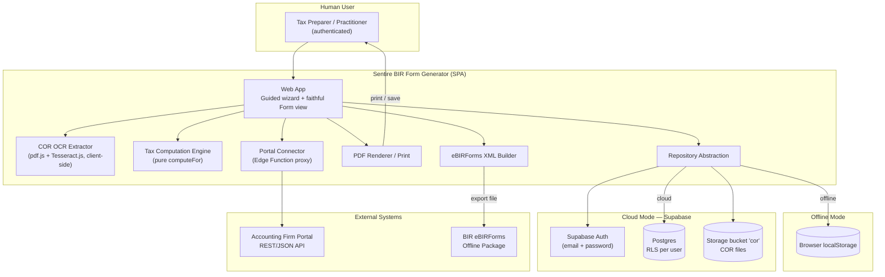

---

## 2. System Requirements

Requirements are split into **Functional (FR)** — what the system must do — and **Non-Functional
(NFR)** — how well it must do it.

### 2.1 Functional Requirements

#### Authentication & Account

| ID | Requirement |
|---|---|
| FR-01 | In cloud mode the system shall authenticate users via **email + password** (Supabase Auth) and gate all data behind a signed-in session. |
| FR-02 | The system shall isolate every user's data with **row-level security** (`owner_id = auth.uid()`); a user never sees another account's taxpayers or filings. |
| FR-03 | The system shall run **offline** with no backend, persisting to `localStorage`, when Supabase is not configured. |

#### Taxpayer Management

| ID | Requirement |
|---|---|
| FR-04 | The system shall create and maintain **taxpayer profiles** for individuals and non-individuals (name/registered name, TIN, branch, RDO, address, ZIP, classification, contact, civil status, taxpayer type, birth/incorporation date). |
| FR-05 | Each taxpayer shall carry a **Trade Name** and a repeating **Tax Types** table (type · form · frequency · start date) as printed on the BIR COR. |
| FR-06 | The system shall allow **uploading a BIR COR (Form 2303)** file (PDF/image) and storing it privately per taxpayer (cloud mode). |
| FR-07 | On COR upload the system shall **auto-extract** fields **entirely in the browser** (OCR): TIN, branch, RDO, taxpayer name, trade name, address/ZIP, and the tax-types table. |
| FR-08 | Auto-extracted values shall be **presented for review** and applied only on explicit user confirmation; extracted tax types are **merged** into (not replace) existing rows. |

#### Form Filing

| ID | Requirement |
|---|---|
| FR-09 | The system shall let a user **start a new filing** by choosing a form, a period (year and, where applicable, quarter), and a taxpayer. |
| FR-10 | Each form shall offer two views — a **Guided** wizard and a pixel-faithful **Form** view — that stay in sync through the shared computation result. |
| FR-11 | The system shall **autosave** raw field values as the user edits, storing **only entered values** (computed figures are always derived). |
| FR-12 | The system shall support repeating line tables for forms that need them (2307, 2551Q schedules). |
| FR-13 | The system shall let a user **list, open, duplicate, and delete** filings for a taxpayer. |

#### Tax Computation

| ID | Requirement |
|---|---|
| FR-14 | The system shall compute each form's figures with a **pure, deterministic engine** selected per form via a `computeFor()` dispatcher. |
| FR-15 | The engine shall support the required methods: **graduated (TRAIN)**, **8% flat**, **percentage tax (ATC × rate)**, **MCIT (higher-of)**, **OSD (40%)**, and **NOLCO** carry-over. |
| FR-16 | Computed values shall **never be stored** — they are re-derived from `FilingData` on every render and export. |

#### Output — XML, PDF, Print

| ID | Requirement |
|---|---|
| FR-17 | The system shall export **authentic eBIRForms XML** for supported forms, byte-aligned to the official offline package (correct namespaces, field keys, and tail). |
| FR-18 | The system shall retain a short history of generated XML exports against each filing. |
| FR-19 | The system shall render a **live A4 PDF preview** of the faithful form and support printing / save-as-PDF. |

#### Accounting Firm Portal Integration (see §7)

| ID | Requirement |
|---|---|
| FR-20 | The system shall **import a client** from the Accounting Firm Portal and map it to a Taxpayer profile. |
| FR-21 | The system shall **import a tax computation** (and, where needed, sales/expense figures) from the Portal to **pre-fill** a filing for a chosen form and period. |
| FR-22 | The system shall **push the generated BIR filing** — form, period, status, eBIRForms XML, and PDF — **back to the Portal** against the originating client. |
| FR-23 | Portal credentials shall be held **server-side** (a Supabase Edge Function proxy); the browser shall never hold the Portal client secret. |

### 2.2 Non-Functional Requirements

| ID | Category | Requirement |
|---|---|---|
| NFR-01 | Correctness | Tax math is the highest-value code: pure engines with unit tests covering every form; XML builders verified byte-for-byte against authentic samples. |
| NFR-02 | Fidelity | The Form view reproduces the official BIR layout closely enough to print and file on A4. |
| NFR-03 | Security | TLS in transit; Supabase RLS scopes every row to the owner; the private `cor` bucket is owner-scoped; Portal secrets never reach the browser. |
| NFR-04 | Privacy | COR files carry TIN and personal data; **OCR runs client-side** so the document is not sent to any third party for extraction. |
| NFR-05 | Performance | Typical interactions under ~1s; heavy libs (pdf.js, Tesseract) are **lazy-loaded** only when a COR is processed, keeping the main bundle lean. |
| NFR-06 | Availability / Offline | Works fully offline against `localStorage`; cloud writes are debounced write-through against an in-memory cache. |
| NFR-07 | Maintainability | Pure compute modules, one per form, plus a dispatcher; swappable repository behind a single interface. |
| NFR-08 | Portability | Same domain model persists to either `localStorage` or Supabase with no UI changes. |
| NFR-09 | Interoperability | Standard eBIRForms XML output; REST/JSON connector to the Accounting Firm Portal. |
| NFR-10 | Auditability | Cloud writes are surfaced on failure; XML exports are timestamped and retained per filing. |

---

## 3. System Actors

### 3.1 Primary (Human) Actor

| Actor | Description |
|---|---|
| **Tax Preparer / Practitioner** | The authenticated user. Creates and maintains taxpayers, uploads CORs, generates and fills forms, computes tax, and exports eBIRForms XML / PDFs. In the current system this is a **single owner per account**; all data is RLS-scoped to this user. |

> The **Taxpayer** (the individual/company the forms are *about*) is a **data subject**, not a system
> user — it does not log in.

### 3.2 Secondary (System / External) Actors

| Actor | Role in the System |
|---|---|
| **Supabase Auth** | Identity provider for cloud mode (email + password sessions). |
| **Supabase Postgres + Storage** | Cloud data store (taxpayers, filings, exports) and the private `cor` file bucket. |
| **COR OCR Engine** | `pdf.js` rasterizes the COR; a canvas binarize step drops the security background; `Tesseract.js` reads the text; a pure parser extracts the fields — all **in the browser**. |
| **Tax Computation Engine** | Pure `computeFor()` modules that derive each form's figures. |
| **eBIRForms XML Builder** | Produces the authentic XML export per form. |
| **PDF Renderer** | Rasterizes the faithful A4 form to a PDF for preview / print. |
| **Accounting Firm Portal** | External REST/JSON system of record for clients and tax computations (see §7). |
| **BIR eBIRForms Offline Package** | The downstream tool that ingests the exported XML for actual filing (out of scope). |

---

## 4. Top Use Cases

### 4.1 Use-Case Summary

| ID | Use Case | Primary Actor(s) |
|---|---|---|
| UC-01 | Authenticate / sign in | Tax Preparer |
| UC-02 | Create / edit a taxpayer profile | Tax Preparer |
| UC-03 | Upload COR & auto-extract details (OCR) | Tax Preparer |
| UC-04 | Start a new filing (form + period + taxpayer) | Tax Preparer |
| UC-05 | Fill a form via the Guided wizard | Tax Preparer |
| UC-06 | Fill / adjust in the faithful Form view | Tax Preparer |
| UC-07 | Compute tax (derived, on demand) | System (on behalf of user) |
| UC-08 | Export eBIRForms XML | Tax Preparer |
| UC-09 | Preview / print the A4 PDF | Tax Preparer |
| UC-10 | Import a client & tax computation from the Portal | Tax Preparer |
| UC-11 | Push the generated filing back to the Portal | Tax Preparer |
| UC-12 | Manage filings (list, duplicate, delete) | Tax Preparer |

### 4.2 Use-Case Diagram

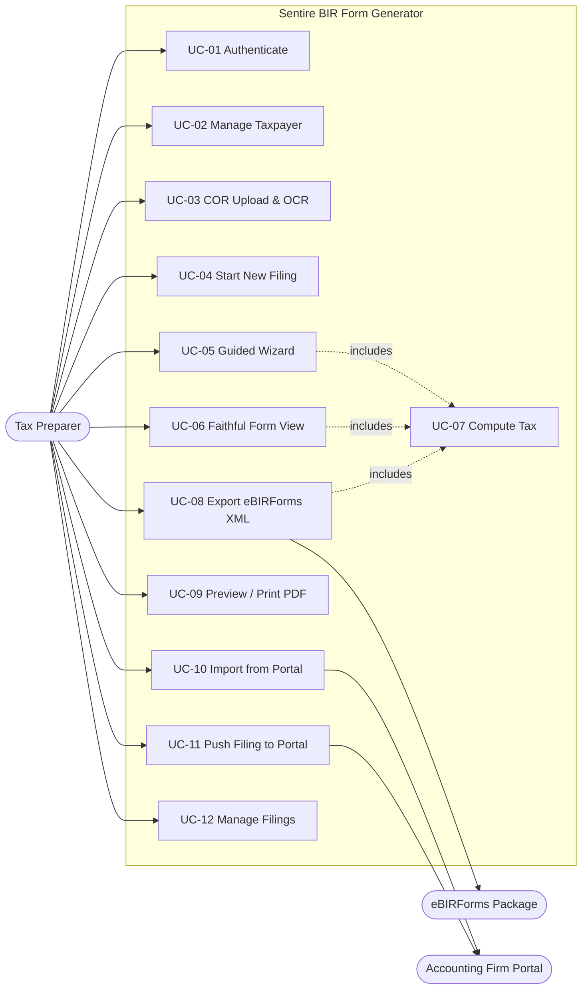

### 4.3 Detailed Use-Case Specifications

The four highest-value use cases are specified in full.

#### UC-03 — Upload COR & Auto-Extract Details (OCR)

| Field | Detail |
|---|---|
| **Actor** | Tax Preparer |
| **Goal** | Populate a taxpayer profile from a scanned BIR COR without manual typing. |
| **Preconditions** | User is authenticated (cloud mode); a taxpayer editor is open; a COR PDF/image is available. |
| **Main Flow** | 1. User attaches a COR file in the taxpayer editor. 2. The browser rasterizes it (pdf.js), binarizes to drop the green security pattern, and runs OCR (Tesseract.js). 3. The parser extracts TIN, branch, RDO, name, **trade name**, address/ZIP, and the **tax-types** table. 4. The system shows a **"Details read from the COR"** review panel. 5. User clicks **Apply**; non-empty fields fill the form and tax types are **merged** (deduped) into any existing rows. 6. User saves the taxpayer; the COR file is stored privately. |
| **Alternate Flows** | 2a. Poor scan → some cells are unreadable; only legible fields are proposed, the rest are left blank for manual entry. 5a. User **dismisses** the panel and enters data manually. |
| **Exceptions** | Unreadable/broken file → message; the taxpayer can still be saved and the COR re-attached later. |
| **Postconditions** | The taxpayer profile is populated (subject to user review); the COR file is retained. |

#### UC-07 / UC-08 — Compute Tax & Export eBIRForms XML

| Field | Detail |
|---|---|
| **Actor** | Tax Preparer (System computes) |
| **Goal** | Produce the correct figures for a form and emit its authentic eBIRForms XML. |
| **Preconditions** | A filing exists with the required raw field values entered. |
| **Main Flow** | 1. On every edit, `computeFor(form, filing, taxpayer)` derives the form's figures (gross, deductions, taxable income, tax due, credits, amount payable). 2. Both the Guided and Form views render from this single result. 3. User selects **Export XML**. 4. The per-form XML builder assembles the byte-aligned eBIRForms document (namespace, field keys, tail). 5. The XML is offered for download and recorded in the filing's export history. |
| **Alternate Flows** | 1a. User switches deduction method (e.g. OSD vs itemized, or 8% vs graduated) and the result recomputes. |
| **Exceptions** | Missing required inputs → the affected figures show as zero/blank; validation surfaces the gaps. |
| **Postconditions** | A downloaded XML file ready for the eBIRForms offline package; an export entry saved on the filing. |

#### UC-10 — Import a Client & Tax Computation from the Portal

| Field | Detail |
|---|---|
| **Actor** | Tax Preparer |
| **Goal** | Reuse the Portal's client profile and computed figures to pre-fill a BIR filing. |
| **Preconditions** | The Portal integration is configured; the firm's token grants access to the client. |
| **Main Flow** | 1. User chooses **Import from Portal** and picks a client. 2. The connector calls the Portal API (via the Edge Function proxy) for the client profile and a selected **TaxComputation**. 3. The system maps the client to a **Taxpayer** and the computation to a **filing's `FilingData`** for the chosen form and period (see §7.3). 4. User reviews the pre-filled Guided/Form view and adjusts as needed. |
| **Alternate Flows** | 2a. No tax computation for the period → import the client profile only and enter figures manually. |
| **Exceptions** | Token invalid/expired → prompt to re-authorize; client not accessible → blocked with a clear message. |
| **Postconditions** | A taxpayer and a pre-filled filing exist, linked to the Portal client id for later push-back. |

#### UC-11 — Push the Generated Filing Back to the Portal

| Field | Detail |
|---|---|
| **Actor** | Tax Preparer |
| **Goal** | Record the produced BIR form (status + XML + PDF) on the Portal's client record. |
| **Preconditions** | The filing was created from (or linked to) a Portal client; XML/PDF generated. |
| **Main Flow** | 1. User marks the filing **filed** (or **ready**) and selects **Sync to Portal**. 2. The connector `POST`s the filing artifact to the Portal (`bir-filings` endpoint) with the client id, form, period, status, XML, and PDF link. 3. The Portal stores it against the client and returns a reference id. 4. The system records the Portal reference on the filing. |
| **Alternate Flows** | 2a. Idempotent re-send updates the existing Portal record (keyed by client + form + period). |
| **Exceptions** | Portal unreachable → the push is marked pending and retried; nothing local is lost. |
| **Postconditions** | The Portal client shows the BIR filing and can download its XML/PDF. |

---

## 5. Class Diagram (Domain Model)

The model is shown as two connected views. **View A** covers the persisted domain (taxpayers,
filings, persistence). **View B** covers the derived computation & export pipeline. `Filing` bridges
them: it is stored, but its figures are produced on demand.

### 5.1 View A — Domain & Persistence

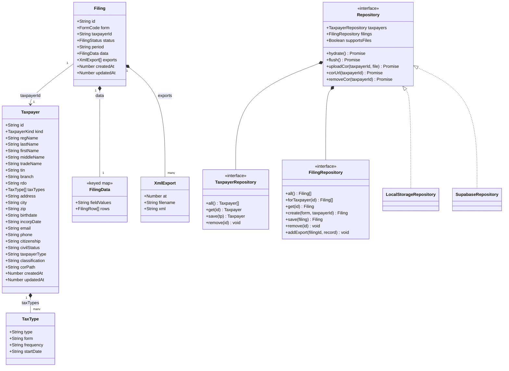

### 5.2 View B — Computation & Export Pipeline

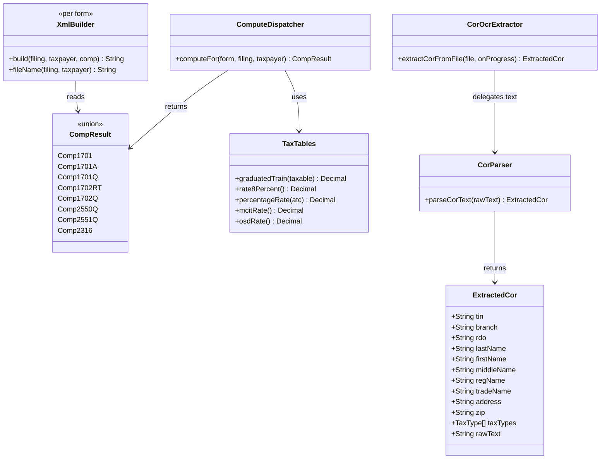

### 5.3 Key Entity Notes

- **Taxpayer is the reuse anchor** — one profile feeds background info into every form; `taxTypes`
  (from the COR) records which returns the filer is registered for.
- **`Filing` stores raw values only** — `FilingData` is a keyed map of what the user typed; computed
  figures are re-derived by `computeFor()` and never written back.
- **`Repository` is swappable** — the identical domain persists to `localStorage` or Supabase; only
  the cloud implementation `supportsFiles` (COR uploads).
- **Computation is pure** — `computeFor()` returns a per-form `CompResult`; both views and the XML
  builder read the *same* result, guaranteeing the Guided and Form views agree.
- **OCR is two-stage** — `extractCorFromFile()` handles the browser IO (rasterize + OCR); the pure
  `parseCorText()` turns noisy OCR text into an `ExtractedCor`, which is unit-tested against real scans.

---

## 6. Activity Diagrams

### 6.1 AD-01 — End-to-End: New Filing → Fill → Export

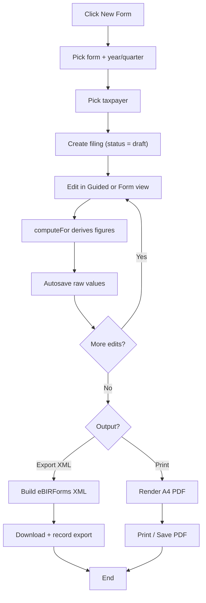

### 6.2 AD-02 — COR Upload & OCR Auto-Extract

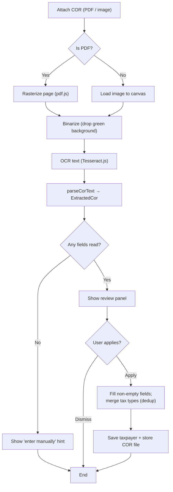

### 6.3 AD-03 — Guided / Form Editing with Autosave & Compute

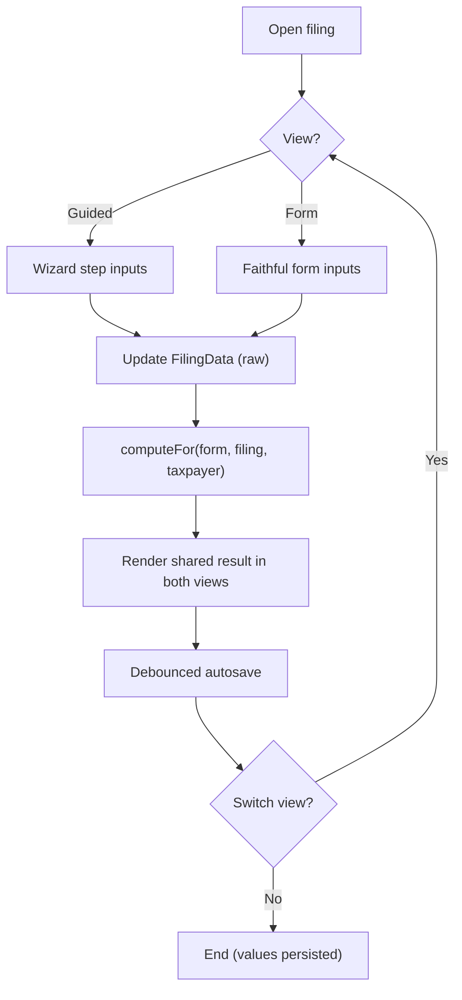

### 6.4 AD-04 — Export eBIRForms XML

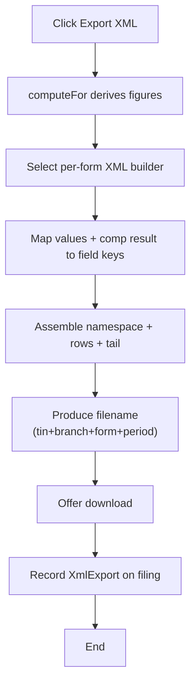

### 6.5 AD-05 — Import Client & Tax Computation from the Portal

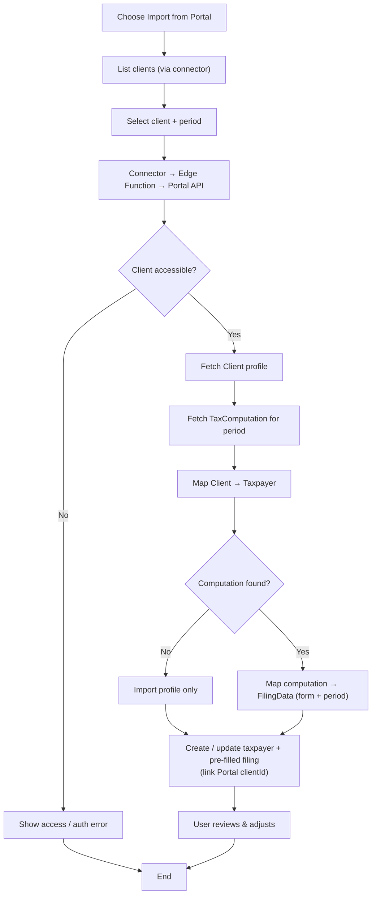

### 6.6 AD-06 — Push Generated Filing Back to the Portal

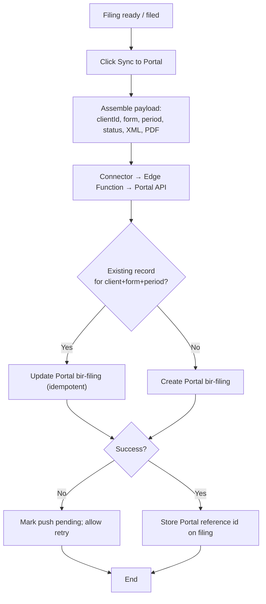

---

## 7. API Integration — Accounting Firm Portal

> **This section is a build contract.** The Accounting Firm Portal is being created **from scratch**;
> this section **directs what the Portal must implement** to serve the BIR Form Generator. Treat the
> data model (§7.3) and endpoints (§7.6–7.7) as the Portal's required specification for this integration.

The two systems are complementary:

- The **Portal** is the **system of record** for clients and their **per-transaction** financial data.
  It must **classify every transaction for tax at capture time** (§7.3) and expose **aggregation
  endpoints** (§7.6) that roll those transactions up into the exact shapes the BIR forms need.
- The **BIR Form Generator** is the **specialist producer** of official BIR forms and eBIRForms XML. It
  owns the **taxpayer registration** (tax types / percentage-tax **ATC & rate**, sourced from the COR),
  the **period-to-period carry-overs** (excess input VAT, capital-goods amortization, prior payments),
  and it **pushes** finished filings — plus an **Input Tax Asset** figure — back to the Portal (§7.7).

### 7.1 Responsibility Split

| Capability | Owner |
|---|---|
| Client profiles | **Accounting Firm Portal** |
| **Per-transaction income & purchase records + tax classification** (§7.3) | **Accounting Firm Portal** |
| **Aggregation endpoints** — VAT summary, percentage receipts, income-tax summary (§7.6) | **Accounting Firm Portal** |
| Filing artifact **and Input Tax Asset** booking on the client record (§7.7) | **Portal** (values pushed by the Generator) |
| BIR form layout, field-level filling, form-specific rules | **BIR Form Generator** |
| **Taxpayer registration** — tax types + **percentage-tax ATC & rate** (from the COR) | **BIR Form Generator** |
| **Period carry-overs** — excess input VAT (Input Tax Asset), capital-goods >₱1M amortization | **BIR Form Generator** |
| eBIRForms XML export & A4 PDF | **BIR Form Generator** |

### 7.2 Integration Architecture & Trust Boundary

The BIR Form Generator is a browser SPA, so Portal credentials must **not** live in client code. All
Portal calls route through a small **server-side connector** (a Supabase **Edge Function**,
`portal-sync`) that holds the Portal OAuth client secret / API key and enforces the trust boundary.

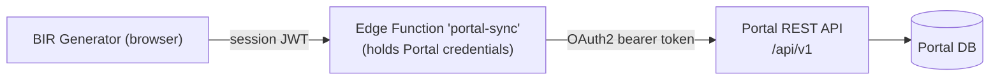

- **Auth to the Portal:** OAuth2 **client-credentials** (server-to-server) yielding a bearer token
  scoped to the firm; the Portal enforces which **clients** are visible (its assigned-clients RBAC).
- **Auth to the connector:** the browser presents its Supabase session JWT; the Edge Function verifies
  it before calling the Portal, so only the signed-in practitioner can trigger a sync.
- **Scopes requested:** `clients:read`, `tax-computations:read`, `vat-summary:read`,
  `percentage-tax-summary:read`, `transactions:read`, `bir-filings:read`, `bir-filings:write`,
  `input-tax-asset:write`.

### 7.3 Portal Data Model — What the Portal Must Build

To serve **VAT (2550Q)** and **Percentage Tax (2551Q)**, aggregate totals are not enough — the Portal
must **classify each transaction for tax at the moment it is recorded**. The Portal must implement two
record types (extending its `SalesRecord` / `ExpenseRecord`) with the BIR-specific fields below. All
amounts are **exclusive of VAT** (net); VAT is carried separately.

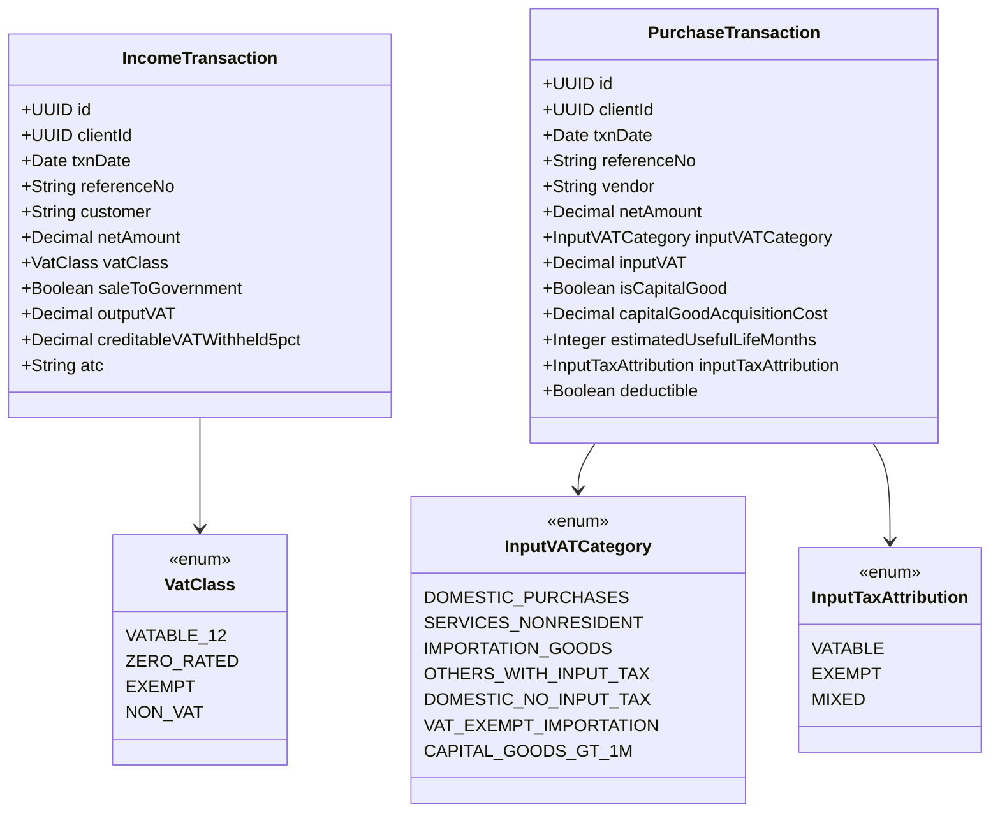

**Field semantics & the actual April-2024 2550Q line each fills** (Items 44–49 follow the real form:
44 Domestic Purchases · 45 Services by Non-residents · 46 Importation · 47 Others · 48 Domestic
Purchases with No Input Tax · 49 VAT-Exempt Importations — capital goods >₱1M are **not** a current-
purchase line, they are amortized via Schedule 1):

| Field | Applies to | Fills / drives (2550Q unless noted) |
|---|---|---|
| `netAmount` (income) + `vatClass = VATABLE_12` | VAT clients | **Item 31A** vatable sales; the Generator derives **Item 31B** = 12% × net |
| `vatClass = ZERO_RATED` | VAT clients | **Item 32A** zero-rated sales |
| `vatClass = EXEMPT` | VAT clients | **Item 33A** exempt sales |
| `vatClass = NON_VAT` | percentage clients | **2551Q** taxable gross receipts (ATC & rate resolved by the Generator) |
| `saleToGovernment` (overlay — the sale is **also** `VATABLE_12`) + `creditableVATWithheld5pct` | VAT clients | the 5% withheld → part of **Item 16**; the sale itself sits in Item 31 |
| `inputVATCategory = DOMESTIC_PURCHASES` (incl. capital goods ≤₱1M, claimed in full) | purchases | **Item 44A/B** |
| `inputVATCategory = SERVICES_NONRESIDENT` | purchases | **Item 45A/B** |
| `inputVATCategory = IMPORTATION_GOODS` | purchases | **Item 46A/B** |
| `inputVATCategory = OTHERS_WITH_INPUT_TAX` | purchases | **Item 47A/B** |
| `inputVATCategory = DOMESTIC_NO_INPUT_TAX` | purchases | **Item 48A** (amount only) |
| `inputVATCategory = VAT_EXEMPT_IMPORTATION` | purchases | **Item 49A** (amount only) |
| `inputVATCategory = CAPITAL_GOODS_GT_1M` (+ `capitalGoodAcquisitionCost`, `estimatedUsefulLifeMonths`) | purchases | **Schedule 1** amortization only (Items 39 / 52); the current-period claimable portion is Generator-computed |
| `inputTaxAttribution = EXEMPT` | purchases | directly-attributable exempt input tax → **Schedule 2 / Item 53** |
| `inputTaxAttribution = MIXED` | purchases | common input tax → the Generator apportions the ratable exempt share (**Schedule 2**) |

> **Regime note.** A client is **either** VAT-registered **or** percentage-tax (non-VAT) — determined
> by its COR tax types (held in the Generator). For **VAT** clients, income transactions carry a real
> `vatClass`; for **percentage** clients, income transactions are `NON_VAT` and only the **gross
> receipts total** matters (the ATC & rate are supplied by the Generator's taxpayer profile, not the
> Portal). The `atc` field on `IncomeTransaction` is optional — populate it only if a client has
> multiple percentage-tax streams.

### 7.4 Portal → Generator: Client & Registration Mapping

**Portal `Client` → BIR `Taxpayer`:**

| Portal `Client` | BIR `Taxpayer` | Notes |
|---|---|---|
| `businessName` | `regName` (non-individual) / `tradeName` | Individual name is split when available. |
| `tin` | `tin` (+ `branch`) | Normalized to 9 digits; branch default `00000`. |
| `address` | `address` (+ `zip`) | ZIP parsed out when present. |
| `taxType` | seeds `taxTypes[]` + suggests the **form** | e.g. *Percentage Tax* → 2551Q; *VAT* → 2550Q; *Income Tax* → 1701 / 1701A / 1701Q / 1702RT / 1702Q. |
| `fiscalYearStart` | period basis | Drives calendar vs fiscal handling. |
| `id` | `externalClientId` (link) | Stored on the taxpayer/filing for push-back. |

> **The percentage-tax ATC & rate are NOT taken from the Portal.** The **ATC** is fixed per client by the
> COR and lives on the Generator's **Taxpayer profile** (`taxTypes`); the Generator's taxpayer editor
> should capture it (default **PT010**, Sec. 116). The **rate is not a stored value** — the Generator
> resolves it from a built-in **ATC → rate catalog keyed by filing period**, because the Sec. 116 rate is
> period-dependent (**1%** for 1 Jul 2020 – 30 Jun 2023 under CREATE, otherwise **3%**). So the Portal
> supplies only the *amount* (gross receipts); the Generator supplies the *ATC* and the *period-correct
> rate*.

**Portal `TaxComputation` → BIR `FilingData` (income-tax summary lines):**

| Portal `TaxComputation` | BIR field (conceptual) |
|---|---|
| `grossIncome` | Sales / gross receipts / gross income line |
| `totalDeductions` | Itemized deductions or OSD base |
| `taxableIncome` | Taxable income line |
| `grossTaxDue` | Tax due |
| `taxCredits` | Creditable withholding / prior payments |
| `netTaxPayable` | Total amount payable / (overpayment) |
| `periodType` + `periodStart/End` | Filing `period` (year / quarter) |

> The Generator treats all imported figures as **inputs to review**: they pre-fill `FilingData`, then
> the pure engine recomputes so the Portal's numbers and the BIR form's numbers are reconciled, not
> blindly trusted.

### 7.5 Data Required to Fill Each Form (Inbound Data Contract)

This subsection states, per form, exactly what the Generator needs and where each item comes from — so
the Portal API is scoped to actually fill the forms, not just their totals.

**Source legend** — **T** Taxpayer profile / registration (Generator; from the COR) · **A** Portal
aggregate `TaxComputation` (income-tax summary) · **L** Portal **per-transaction classified data**
(§7.3, via the aggregation endpoints in §7.6) · **G** Generator-owned carry-over state · **M** manual /
firm input.

| Form | Required input data (beyond taxpayer background = **T**) | Source |
|---|---|---|
| **1701** (annual, individuals — mixed) | Gross sales/receipts & returns; cost of sales/services; itemized deductions **or** OSD (method **M**); other income; exempt & special-rate income; **NOLCO**; creditable withholding; prior-quarter payments; foreign credits; penalties; spouse income. | A + L + **M** (NOLCO, foreign credits, penalties, method) |
| **1701A** (annual — purely business/profession) | Method **8% vs graduated+OSD** (**M**); gross sales/receipts; cost & allowable deductions; creditable withholding; prior payments. | A + L + **M** |
| **1701Q** (quarterly, individuals) | Quarter **and cumulative** gross sales/receipts; cost; deductions/OSD; creditable withholding; prior-quarter payments; 8% option (**M**). | A + L + **M** |
| **1702RT** (annual, corporations — regular) | Sales; cost of sales; gross income; other income; itemized deductions **or** OSD; **gross income for MCIT (2%)**; creditable withholding; prior payments; **excess MCIT**; **NOLCO**. | A + L + **M** (MCIT excess, NOLCO) |
| **1702Q** (quarterly, corporations) | Quarterly + cumulative sales, cost, deductions, taxable income; **MCIT quarterly gross income**; creditable withholding; prior payments. | A + L + **M** |
| **2550Q** (quarterly VAT) ✅ *resolved* | **Sales by VAT class** (vatable → output VAT, zero-rated, exempt; government sales are vatable + 5% withheld); **purchases** by the real Items 44–49 categories with input VAT; capital-goods >₱1M amortization inputs (Schedule 1); directly-attributable / common exempt input tax (Schedule 2); creditable VAT withheld & advance payments (Schedules 3/4). Input-tax **carry-over** and amortization are Generator-owned. | **L** (`vat-summary`, §7.6) + **G** (carry-over, amortization) + **M** (see manual lines below) |
| **2551Q** (quarterly percentage tax) ✅ *resolved* | **Taxable gross receipts** for the quarter (per ATC if multiple); the **ATC** (from **T**) and the **period-correct rate** (Generator catalog); tax paid in a previously-filed **amended** return; other credits; penalties. | **L** (`percentage-tax-summary`, §7.6) + **T** (ATC) + **M** (credits, penalties) |
| **2307** (creditable withholding cert.) — *standalone* | Payee & payor identity; income payments per ATC per month; tax withheld per ATC. | **Out of API scope** — see §7.10 |
| **2316** (compensation cert.) — *standalone* | Employer & employee details; gross/non-taxable/taxable compensation; tax withheld; premiums; prior employer. | **Out of API scope** — see §7.10 |

**How the two resolved forms are covered — and which lines stay manual:**

1. **2550Q (VAT)** — the **transaction-driven** lines come from `vat-summary`: output lines (Items
   31–33) from `vatClass`; current-purchase input lines (Items 44–49) from `inputVATCategory`; Schedule 1
   from `CAPITAL_GOODS_GT_1M`; Schedule 2 from `inputTaxAttribution`; Schedules 3/4 (creditable VAT
   withheld, advance payments) from the roll-up. The Generator owns **Item 38 carry-over** and the
   running **capital-goods amortization** and returns the **Input Tax Asset** (§7.7). The following
   remain **manual (M)** — they are statutory/adjustment/amended-return fields the Portal does not track:
   **Items 35 & 36** (output-VAT adjustments on un/recovered receivables), **40 41 42** (transitional /
   presumptive / other input tax), **54** (VAT refund/TCC claimed), **55 56 58** (unpaid-payable & other
   input-tax adjustments), **18 & 19** (VAT paid on prior/amended return, other credits), and **22–24**
   (penalties).
2. **2551Q (Percentage)** — `percentage-tax-summary` returns **gross receipts**; the **ATC** comes from
   the taxpayer profile and the **rate** from the Generator's period-keyed catalog (§7.4). Manual (M):
   **Item 15** creditable percentage tax withheld (until the 2307 enhancement, §7.10), **Item 16** tax
   paid on an amended return, **Item 17** other credit, and **penalties**. Derived by the engine: Items
   14, 18, 19, 23, 24.
3. **Income-tax forms** — the `TaxComputation` fills summary lines; **NOLCO, excess MCIT, foreign
   credits, penalties, prior payments, and method elections** remain **manual / carry-over** inputs.

### 7.6 Endpoints the Portal Must Expose (Portal → Generator)

Base: `{PORTAL_BASE}/api/v1` — all calls via the `portal-sync` Edge Function with an OAuth2 bearer token.

| Method & Path | Purpose | Fills |
|---|---|---|
| `GET /clients?assignedTo=me&query=` | List/select importable clients | Import picker |
| `GET /clients/{clientId}` | One client profile | → Taxpayer (§7.4) |
| `GET /clients/{clientId}/tax-computations?periodType=&periodStart=&periodEnd=` | Income-tax **summary** figures | 1701 / 1701A / 1701Q / 1702RT / 1702Q summary lines |
| `GET /clients/{clientId}/vat-summary?year=&quarter=` | 2550Q roll-up of classified transactions | The transaction-driven 2550Q lines (see §7.5 for the manual ones) |
| `GET /clients/{clientId}/percentage-tax-summary?year=&quarter=` | **2551Q gross receipts** (per ATC if any) | 2551Q Schedule 1 base |
| `GET /clients/{clientId}/income-transactions?from=&to=` | Raw classified income rows (drill-down / audit) | line-level verification |
| `GET /clients/{clientId}/purchase-transactions?from=&to=` | Raw classified purchase rows (drill-down / audit) | line-level verification |

**`vat-summary` response** — keys map to the actual April-2024 2550Q lines shown in the comments. All
`net` amounts are exclusive of VAT. Government sales are **not** a separate output line: they are
included in `sales.vatable` and additionally carry a memo `creditableVATWithheld5pct` (→ Item 16):

```json
{
  "client": { "id": "cl_123", "tin": "471522378", "vatRegistered": true },
  "period": { "year": 2026, "quarter": 1, "start": "2026-01-01", "end": "2026-03-31" },
  "sales": {
    "vatable":   { "net": 400000.00, "outputVAT": 48000.00 },   // Item 31 (incl. government sales)
    "zeroRated": { "net": 0.00 },                                // Item 32
    "exempt":    { "net": 0.00 },                                // Item 33
    "governmentSalesMemo": { "net": 100000.00, "creditableVATWithheld5pct": 5000.00 }  // subset of vatable -> Item 16
  },
  "purchases": {
    "domesticPurchases":   { "net": 300000.00, "inputVAT": 36000.00 },   // Item 44 (incl. capital goods <=P1M)
    "servicesNonResident": { "net": 0.00, "inputVAT": 0.00 },            // Item 45
    "importationGoods":    { "net": 0.00, "inputVAT": 0.00 },            // Item 46
    "othersWithInputTax":  { "net": 0.00, "inputVAT": 0.00 },            // Item 47
    "domesticNoInputTax":  { "net": 0.00 },                              // Item 48 (amount only)
    "vatExemptImportation":{ "net": 0.00 },                              // Item 49 (amount only)
    "capitalGoodsGT1M": {                                                // Schedule 1 ONLY (not Items 44-49)
      "items": [ { "acquiredOn": "2026-02-10", "cost": 1500000.00, "inputVAT": 180000.00, "usefulLifeMonths": 60 } ]
    }
  },
  "exemptInputTax": {
    "directlyAttributable":     0.00,   // -> Schedule 2 (sch2_direct)
    "commonNotDirectlyAttributable": 0.00   // Generator apportions the ratable exempt share -> Schedule 2
  },
  "otherCredits": {
    "creditableVATWithheld": 5000.00,   // Item 16 / Schedule 3 (TOTAL, incl. the government 5% above)
    "advanceVATPayments":    0.00       // Item 17 / Schedule 4
  }
}
```

> **Field → line notes.** `sales.vatable.outputVAT` is **advisory** — the Generator derives Item 31B as
> `12% × net` and uses that. `otherCredits.creditableVATWithheld` is the **single total** for Item 16 and
> already **includes** `governmentSalesMemo.creditableVATWithheld5pct` (no double count). `exemptInputTax`
> returns the two Schedule-2 components (directly-attributable + the common pool) so the Generator can
> compute the ratable exempt portion using total sales; it does **not** return a pre-apportioned figure.
> The **per-row detail** of Schedules 3 & 4 (withholding-agent name, income payment, OR number, etc.) is
> supporting detail only — the **totals above fill Items 16/17**; the row lists are entered manually or
> added by a later extension, and are not required by this contract.

**`percentage-tax-summary` response:**

```json
{
  "client": { "id": "cl_123", "tin": "471522378", "vatRegistered": false },
  "period": { "year": 2026, "quarter": 1, "start": "2026-01-01", "end": "2026-03-31" },
  "grossReceipts": 500000.00,
  "byAtc": [ { "atc": "PT010", "grossReceipts": 500000.00 } ]
}
```

> `byAtc` is optional — the **ATC is authoritative on the Generator's taxpayer profile** (from the COR)
> and the **rate is resolved by the Generator's period-keyed catalog** (§7.4). Populate `byAtc` only when
> a client genuinely has multiple percentage-tax streams. Creditable percentage-tax-withheld (Item 15) is
> **intentionally omitted** — it stays a manual field until the 2307 enhancement (§7.10).

### 7.7 Endpoints the Portal Must Accept (Generator → Portal)

| Method & Path | Purpose |
|---|---|
| `POST /clients/{clientId}/bir-filings` | Create the BIR filing artifact on the client (idempotent-keyed by `client + form + period`) |
| `PUT /clients/{clientId}/bir-filings/{ref}` | Re-sync the same period (update in place) |
| `POST /clients/{clientId}/input-tax-asset` | Book the **Input Tax Asset** the Generator carries forward (excess creditable input VAT + deferred capital-goods input tax) |
| `GET /clients/{clientId}/bir-filings` | Optional: reconcile what the Portal already holds |

**`bir-filings` push-back payload:**

```json
{
  "form": "2550Q",
  "periodType": "quarter",
  "periodStart": "2026-01-01",
  "periodEnd": "2026-03-31",
  "status": "filed",
  "figures": { "outputVAT": 48000.00, "allowableInputVAT": 60000.00, "netVATPayable": -12000.00, "amountPayable": 0.00 },
  "xmlFilename": "471522378000002550Q2026Q1.xml",
  "xmlBase64": "<base64 of the eBIRForms XML>",
  "pdfUrl": "https://<signed-url-to-A4-pdf>"
}
```

> The example is an **excess-input quarter**: input (60,000) exceeds output (48,000), so `netVATPayable`
> is negative (−12,000) and nothing is payable — the 12,000 is carried forward and handed off below.

**`input-tax-asset` handoff payload** — lets the Portal record the input-VAT the Generator carries to the
next period as a balance-sheet **asset**. The carry-over is Generator-owned, but the Portal must know the
amount to book it. Same quarter as the filing above (12,000 excess input VAT + 3,000 deferred
capital-goods input tax = 15,000 total):

```json
{
  "sourceForm": "2550Q",
  "asOfPeriod": { "year": 2026, "quarter": 1 },
  "excessInputTaxCarriedForward": 12000.00,
  "deferredCapitalGoodsInputTax": 3000.00,
  "totalInputTaxAsset": 15000.00,
  "computedAt": "2026-04-20T09:00:00Z"
}
```

### 7.8 Sequence — VAT Import & Push-Back (with Input Tax Asset)

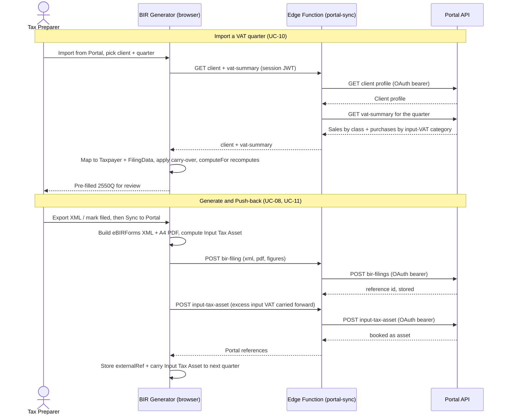

### 7.9 Sync Semantics & Error Handling

| Concern | Approach |
|---|---|
| **Idempotency** | Push-back is keyed by `client + form + period`; a re-send **updates** the existing Portal record rather than duplicating. |
| **Partial data** | If a summary is unavailable for the period, import the client profile only; the practitioner fills figures manually. |
| **Reconciliation** | Imported figures pre-fill inputs; the pure engine recomputes so discrepancies between Portal numbers and BIR rules are visible before filing. |
| **Carry-over ownership** | The Generator is the source of truth for input-tax carry-over and capital-goods amortization; the Portal only **records** the resulting Input Tax Asset it is handed. |
| **Failure** | Portal unreachable → the push is marked **pending** and retried; no local data is lost, and the filing remains usable offline. |
| **Auth expiry** | Expired OAuth token → the Edge Function refreshes (client-credentials) transparently; a hard failure prompts re-authorization. |
| **Least privilege** | The connector requests only read scopes for import and the two write scopes for push-back; the Portal still enforces per-client visibility. |

### 7.10 Standalone Forms — 2307 & 2316 (out of current API scope)

**2307** (Certificate of Creditable Tax Withheld) and **2316** (Certificate of Compensation) are
**as-needed certificates**, not recurring period returns, so they are **not part of this API
integration**. In the Generator they are **standalone forms** filled from their own inputs (manual
entry / their originating document). Two future enhancements are noted for when they are automated:

| Form | Future source | Proposed endpoint (not built now) |
|---|---|---|
| **2307** | Portal **withholding records** | `GET /clients/{id}/withholding-certificates?period=` → income payments & tax withheld per ATC per month |
| **2316** | **Sentire Payroll** | `GET {PAYROLL_BASE}/api/v1/employees/{id}/compensation-summary?year=` → gross/non-taxable/taxable compensation & tax withheld |

Until then, neither the Portal nor the Payroll system needs to build anything for these two forms.

---

## 8. Supported Forms & Computation Engine

### 8.1 Supported Forms

| Form | Title | Category | eBIRForms XML |
|---|---|---|:---:|
| **1701** | Annual Income Tax Return — Individuals (mixed income) | Income Tax | ✔ |
| **1701A** | Annual ITR — Individuals (purely business/profession; 8% or OSD) | Income Tax | ✔ |
| **1701Q** | Quarterly ITR — Individuals | Income Tax | ✔ |
| **1702RT** | Annual ITR — Corporations (Regular Rate) | Income Tax | ✔ |
| **1702Q** | Quarterly ITR — Corporations | Income Tax | ✔ |
| **2550Q** | Quarterly Value-Added Tax Return | Business Tax | ✔ |
| **2551Q** | Quarterly Percentage Tax Return | Business Tax | ✔ |
| **2307** | Certificate of Creditable Tax Withheld at Source | Withholding | — |
| **2316** | Certificate of Compensation Payment / Tax Withheld | Withholding | — |

### 8.2 Computation Methods (pure engine)

| Method | Where used | Formula (conceptual) |
|---|---|---|
| **Graduated (TRAIN)** | 1701 / 1701A / 1701Q | Bracket lookup on taxable income: `baseTax + (taxable − lowerBound) × rate`. |
| **8% Flat** | 1701A / 1701Q | `tax = (gross − ₱250,000 allowance) × 8%` (eligibility-gated). |
| **OSD (40%)** | 1701 / 1701A / 1702 | Optional standard deduction as 40% of the applicable base (per form). |
| **Percentage Tax** | 2551Q | `tax = taxable receipts × ATC rate` (per selected ATC). |
| **VAT** | 2550Q | Output VAT − creditable input VAT for the quarter. |
| **MCIT (2%)** | 1702RT / 1702Q | `higher of` normal income tax `or` 2% of gross income. |
| **NOLCO** | 1701 / 1702 | Net operating loss carry-over applied to taxable income. |

> All rates, tables, and thresholds live in a dedicated `taxTables` module and per-form compute
> modules. They are **derived on demand** and covered by the unit-test suite — the highest-value code
> in the system.

---

## 9. Appendices

### 9.1 Glossary

| Term | Definition |
|---|---|
| **BIR** | Bureau of Internal Revenue (Philippines). |
| **COR / Form 2303** | BIR Certificate of Registration — lists the taxpayer's TIN, RDO, trade name, and registered tax types. |
| **eBIRForms** | The BIR's electronic forms package; consumes the exported XML for filing. |
| **TRAIN** | Tax Reform for Acceleration and Inclusion — the graduated individual income-tax table. |
| **OSD** | Optional Standard Deduction (40%). |
| **MCIT** | Minimum Corporate Income Tax (2% of gross income; higher-of rule). |
| **NOLCO** | Net Operating Loss Carry-Over. |
| **ATC** | Alphanumeric Tax Code — selects the percentage-tax rate on 2551Q. |
| **RLS** | Row-Level Security (Postgres) scoping every row to its owner. |
| **RDO** | Revenue District Office (code). |

### 9.2 Technology Stack

| Layer | Technology |
|---|---|
| Frontend | React 18 + TypeScript (strict) + Vite; React Router |
| Computation | Pure TypeScript modules + Vitest test suite |
| OCR | `pdf.js` (rasterize) + `Tesseract.js` (client-side OCR) |
| Output | Custom eBIRForms XML builders; `jsPDF` / `html-to-image` for A4 PDF |
| Persistence | `localStorage` (offline) or Supabase (Postgres + Storage) behind one `Repository` interface |
| Auth (cloud) | Supabase Auth (email + password), RLS per user |
| Integration | Supabase Edge Function `portal-sync` → Accounting Firm Portal REST API |
| Delivery | Vercel (frontend) + Supabase (backend); CI (typecheck + build + tests) with auto-PR to `main` |

### 9.3 Assumptions

1. One practitioner operates an account; all data is RLS-scoped to that user. Multi-seat firm access
   can be layered on later without changing the domain model.
2. eBIRForms XML is handed to the BIR's offline package; the Generator does not e-file directly.
3. Portal integration credentials are held server-side (Edge Function); the browser never sees them.
4. Currency is PHP for BIR forms; the Portal may hold multi-currency data but figures are filed in PHP.

### 9.4 Out of Scope (this version)

- Direct e-filing / submission to BIR systems.
- General-ledger bookkeeping and bank reconciliation (owned by the Accounting Firm Portal).
- Payment processing.
- Multi-role RBAC inside the Generator (currently single-owner-per-account; the Portal owns RBAC).

---

*End of document.*
